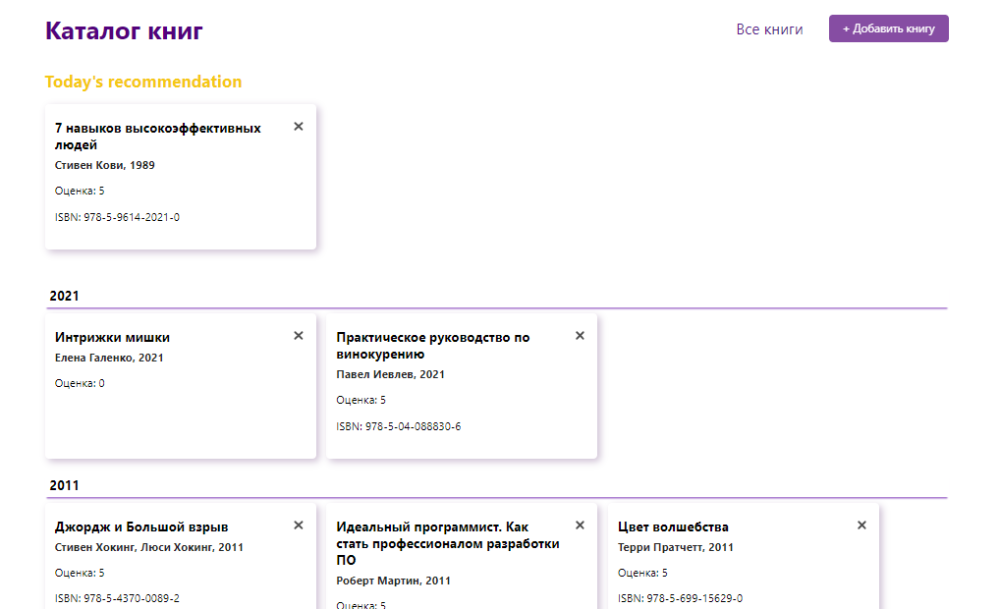
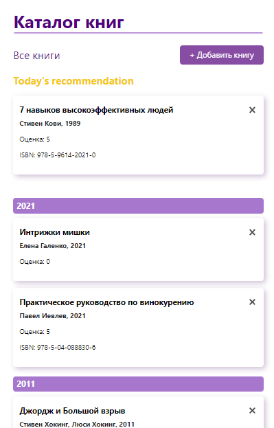

# Каталог книг

Небольшой SPA, разработанный с помощью React.js и Firebase

[Открыть каталог книг 📚](https://magenta-frangipane-4a44d5.netlify.app/)

Основные фичи:
- интеграция с Firebase
- добавление и удаление книг
- минималистичная мобильная и десктопная верстка
- валидация ISBN на этапе заполнения формы

### Screenshots

### Разработан с помощью
- HTML, SCSS, JS
- React
- React DOM
- Firebase
- Lodash
- ISBN Validator

&nbsp;

&nbsp;
